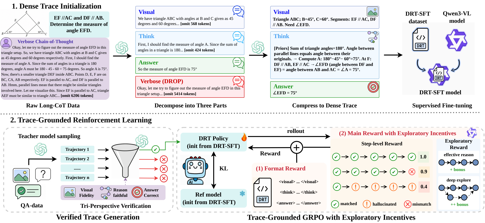

<div align="center">

# DRT: Dense Reasoning Trace

**Compact, visually grounded reasoning through supervised fine-tuning and process-level reinforcement learning.**

[SFT Model](https://huggingface.co/leaderonehit/DRT-SFT-8B) | [RL Model](https://huggingface.co/leaderonehit/DRT-RL-8B) | [SFT Data](https://huggingface.co/datasets/leaderonehit/DRT-SFT-8B-training-data) | [RL Data](https://huggingface.co/datasets/leaderonehit/DRT-RL-8B-training-data) | [Reproduction Guide](reproduce/README.md)

</div>

## Overview

**Dense Reasoning Trace (DRT)** is a data-centric approach to efficient multimodal reasoning. It separates visual observations from logical deduction and expresses reasoning as concise, structured steps instead of verbose narration.

DRT uses two stages built on **Qwen3-VL-8B-Instruct**:

1. **DRT-SFT:** supervised fine-tuning on reformulated multimodal reasoning traces to learn compact, grounded reasoning.
2. **DRT-RL:** process-level reinforcement learning on VisionR1 + DAPO problems to improve answer accuracy while retaining the structured reasoning format.

[](assets/method_v4.2.pdf)

*Dense trace initialization and trace-grounded reinforcement learning. [View the vector PDF](assets/method_v4.2.pdf).*

The visual reasoning format separates evidence, deduction and the answer:

```text
<visual>Concise visual observations</visual>
<think>[Priors] -> relevant relations -> intermediate steps</think>
<answer>Final answer</answer>
```

For text-only tasks, an `<evidence>` block replaces `<visual>`. Benchmark-specific prompts are implemented in the bundled evaluation code.

## Models

| Model | Stage | Released checkpoint | Download |
| --- | --- | --- | --- |
| DRT-SFT-8B | Supervised fine-tuning | SFT iteration 800 | [Hugging Face](https://huggingface.co/leaderonehit/DRT-SFT-8B) |
| DRT-RL-8B | Process-level RL from DRT-SFT | RL step 170 | [Hugging Face](https://huggingface.co/leaderonehit/DRT-RL-8B) |

Both repositories contain full model weights, tokenizer files and processor configuration.

## Results

Paper-reported **accuracy (%)** on five benchmarks. AVG is the unweighted mean, rounded to one decimal place.

| Model | MathVista MINI | MathVerse MINI | LogicVista | GSM8K | Video-Holmes | AVG |
| --- | ---: | ---: | ---: | ---: | ---: | ---: |
| DRT-SFT-8B | 71.5 | 56.2 | 47.2 | 91.0 | 42.8 | 61.7 |
| **DRT-RL-8B** | **76.8** | **64.3** | **56.8** | **94.3** | **43.7** | **67.2** |

RL improves the mean accuracy by **5.4 percentage points**, computed from the five reported benchmark scores before rounding. These are paper results, not a claim that every sampled rerun is numerically identical. See the [evaluation settings](reproduce/README.md#evaluation) to align prompts, decoding and answer judging.

## Training Data

| Dataset | Contents | Samples | Download |
| --- | --- | ---: | --- |
| DRT-SFT | 20 multimodal parquet shards | 194,719 | [Hugging Face](https://huggingface.co/datasets/leaderonehit/DRT-SFT-8B-training-data) |
| DRT-RL | Original VisionR1 + DAPO training split | 14,724 | [Hugging Face](https://huggingface.co/datasets/leaderonehit/DRT-RL-8B-training-data) |
| DRT-RL test split | Held-out evaluation split | 618 | Same RL repository |
| Additional mmfinereason | Separate experimental training set | 32,362 | Same RL repository |

The original RL training split contains **8,936 vision-language** and **5,788 text-only** samples. The additional mmfinereason file is released for related experiments; it is **not** part of the original paper's VisionR1 + DAPO training split.

See [`training_data/`](training_data/README.md) for file names, dataset configurations, checksums and loading examples. All downloads are public and do not require access to the original training infrastructure.

## Quick Start

Clone the code and create a small environment for downloading the artifacts:

```bash
git clone https://github.com/HIT-leaderone/DRT.git
cd DRT
uv venv --python 3.11 .venv-download
source .venv-download/bin/activate
uv pip install huggingface_hub
```

Download a checkpoint and the original RL train/test files:

```python
from huggingface_hub import snapshot_download

snapshot_download("leaderonehit/DRT-RL-8B", local_dir="models/DRT-RL-8B")
snapshot_download(
    "leaderonehit/DRT-RL-8B-training-data",
    repo_type="dataset",
    local_dir="training_data/VisionR1_DAPO",
    allow_patterns=["train.parquet", "test.parquet", "data_manifest.json"],
)
```

To download SFT weights, use `leaderonehit/DRT-SFT-8B`; for SFT data, use `leaderonehit/DRT-SFT-8B-training-data` with `repo_type="dataset"`.

## Training and Evaluation

- **Environment and hardware:** [requirements](reproduce/environment.md).
- **RL training:** [portable Hydra configuration](reproduce/configs/drt_rl.yaml) and [launch instructions](reproduce/README.md#rl-training).
- **SFT:** [recorded training settings](reproduce/configs/drt_sft.yaml), released checkpoint and training data. The original SFT trainer is not bundled as an end-to-end training entrypoint.
- **Evaluation:** [five-benchmark configuration](reproduce/configs/eval.json) using the bundled VLMEvalKit, public checkpoint IDs and the DRT prompt.

The public configuration replaces site-specific scheduler templates with ordinary model/data paths and environment variables. Training requires a compatible GPU software stack; the publication cleanup has not rerun full GPU training or the benchmark suite.

## Repository Layout

```text
DRT/
  Verl/              # RL training, process rewards and data utilities
  VLMEvalkit/        # Model adapters, prompts and benchmark evaluation
  reproduce/         # Portable configuration and environment requirements
  training_data/     # Public download instructions and data manifest
```

## Acknowledgements

This work builds on [Qwen3-VL](https://github.com/QwenLM/Qwen3-VL), [verl](https://github.com/verl-project/verl), [VLMEvalKit](https://github.com/open-compass/VLMEvalKit), [Vision-R1](https://github.com/Osilly/Vision-R1) and [DAPO](https://github.com/BytedTsinghua-SIA/DAPO). We thank the maintainers and dataset authors for their contributions.

The bundled libraries retain their respective [verl license](Verl/LICENSE) and [VLMEvalKit license](VLMEvalkit/LICENSE). Model and dataset use remains subject to the corresponding upstream terms; this repository does not assign a blanket license to third-party assets.
